# 第五章：SQL高级处理

# 5.1 窗口函数

## 5.1.1 窗口函数概念及基本的使用方法

窗口函数也称为**OLAP函数**。OLAP 是 `OnLine AnalyticalProcessing` 的简称，意思是对数据库数据进行实时分析处理。

为了便于理解，称之为 `窗口函数`。常规的SELECT语句都是对整张表进行查询，而窗口函数可以让我们有选择的去某一部分数据进行汇总、计算和排序。

窗口函数的通用形式：

```sql
<窗口函数> OVER ([PARTITION BY <列名>]
                     ORDER BY <排序用列名>)  
```
[   ]中的内容可以省略。

窗口函数最关键的是搞明白关键字 **PARTITON BY** 和 **ORDER BY** 的作用。

**PARTITON BY** 是用来分组，即选择要看哪个窗口，类似于 GROUP BY 子句的分组功能，但是 PARTITION BY 子句并不具备 GROUP BY 子句的汇总功能，并不会改变原始表中记录的行数。

**ORDER BY** 是用来排序，即决定窗口内，是按那种规则(字段)来排序的。

举个栗子:

```sql
SELECT product_name
       ,product_type
       ,sale_price
       ,RANK() OVER (PARTITION BY product_type
                         ORDER BY sale_price) AS ranking
  FROM product;  
```

得到的结果是:

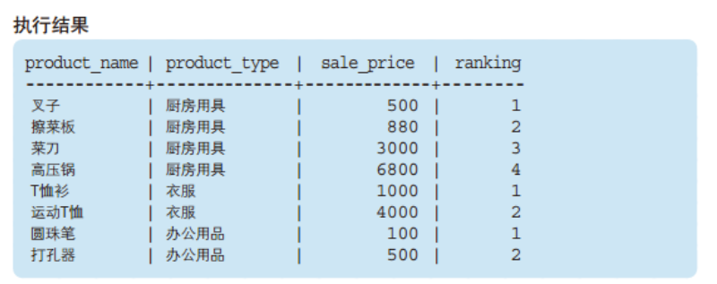

我们先忽略生成的新列 - [ranking]， 看下原始数据在PARTITION BY 和 ORDER BY 关键字的作用下发生了什么变化。

PARTITION BY 能够设定窗口对象范围。本例中，为了按照商品种类进行排序，我们指定了product_type。即一个商品种类就是一个小的"窗口"。

ORDER BY 能够指定按照哪一列、何种顺序进行排序。为了按照销售单价的升序进行排列，我们指定了sale_price。此外，窗口函数中的ORDER BY与SELECT语句末尾的ORDER BY一样，可以通过关键字ASC/DESC来指定升序/降序。省略该关键字时会默认按照ASC，也就是

升序进行排序。本例中就省略了上述关键字 。


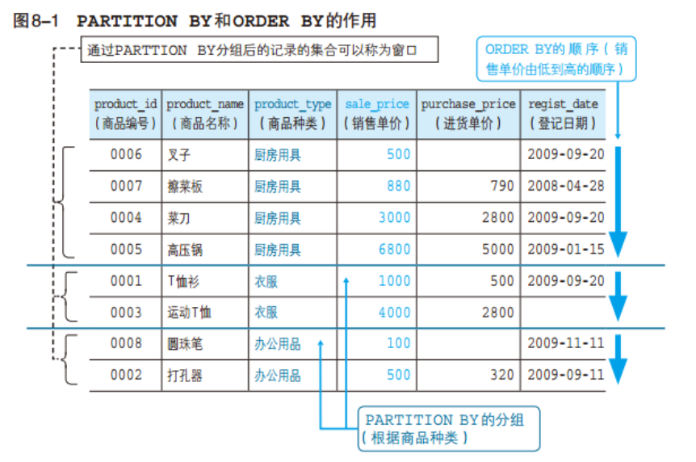


# 5.2 窗口函数种类

大致来说，窗口函数可以分为两类。

一是 将SUM、MAX、MIN等聚合函数用在窗口函数中

二是 RANK、DENSE_RANK等排序用的专用窗口函数

## 5.2.1 专用窗口函数

* **RANK函数**

计算排序时，如果存在相同位次的记录，则会跳过之后的位次。

例）有 3 条记录排在第 1 位时：1 位、1 位、1 位、4 位……

* **DENSE_RANK函数**

同样是计算排序，即使存在相同位次的记录，也不会跳过之后的位次。

例）有 3 条记录排在第 1 位时：1 位、1 位、1 位、2 位……

* **ROW_NUMBER函数**

赋予唯一的连续位次。

例）有 3 条记录排在第 1 位时：1 位、2 位、3 位、4 位

运行以下代码：

```sql
SELECT  product_name
       ,product_type
       ,sale_price
       ,RANK() OVER (ORDER BY sale_price) AS ranking
       ,DENSE_RANK() OVER (ORDER BY sale_price) AS dense_ranking
       ,ROW_NUMBER() OVER (ORDER BY sale_price) AS row_num
  FROM product;  
```

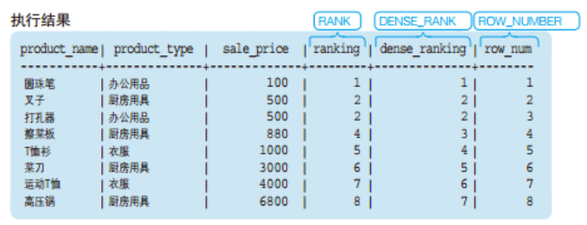


## 5.2.2 聚合函数在窗口函数上的使用

聚合函数在窗口函数中的使用方法和之前的专用窗口函数一样，只是出来的结果是一个**累计**的聚合函数值。

运行以下代码：

```sql
SELECT  product_id
       ,product_name
       ,sale_price
       ,SUM(sale_price) OVER (ORDER BY product_id) AS current_sum
       ,AVG(sale_price) OVER (ORDER BY product_id) AS current_avg  
  FROM product;  
```

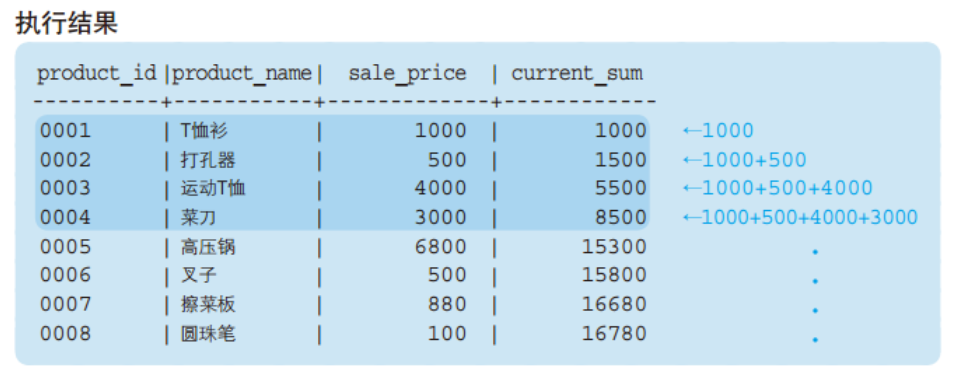

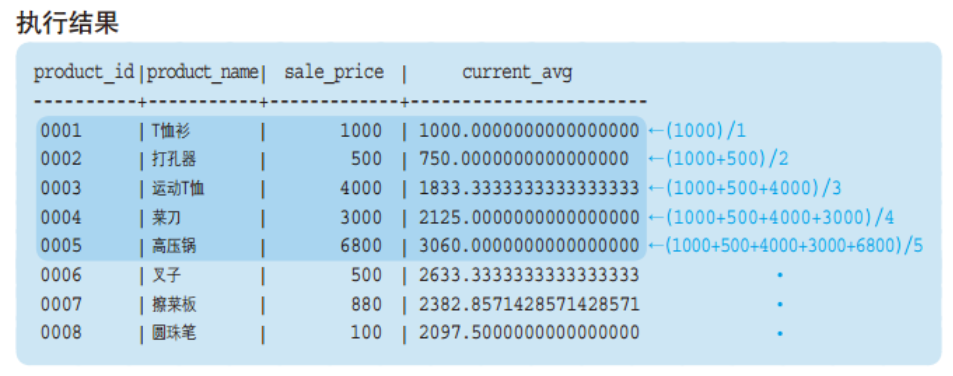

可以看出，聚合函数结果是，按我们指定的排序，这里是product_id，**当前所在行及之前所有的行**的合计或均值。即累计到当前行的聚合。


# 5.3 窗口函数的的应用 - 计算移动平均

在上面提到，聚合函数在窗口函数使用时，计算的是累积到当前行的所有的数据的聚合。 实际上，还可以指定更加详细的**汇总范围**。该汇总范围称为 **框架** (frame)。

语法

```sql
<窗口函数> OVER (ORDER BY <排序用列名>
                 ROWS n PRECEDING )  
                 
<窗口函数> OVER (ORDER BY <排序用列名>
                 ROWS BETWEEN n PRECEDING AND n FOLLOWING)
```
PRECEDING（“之前”）， 将框架指定为 “截止到之前 n 行”，加上自身行

FOLLOWING（“之后”）， 将框架指定为 “截止到之后 n 行”，加上自身行

BETWEEN 1 PRECEDING AND 1 FOLLOWING，将框架指定为 “之前1行” + “之后1行” + “自身”

执行以下代码：

```sql
SELECT  product_id
       ,product_name
       ,sale_price
       ,AVG(sale_price) OVER (ORDER BY product_id
                               ROWS 2 PRECEDING) AS moving_avg
       ,AVG(sale_price) OVER (ORDER BY product_id
                               ROWS BETWEEN 1 PRECEDING 
                                        AND 1 FOLLOWING) AS moving_avg  
  FROM product;  
```

**执行结果：**

注意观察框架的范围。

ROWS 2 PRECEDING：

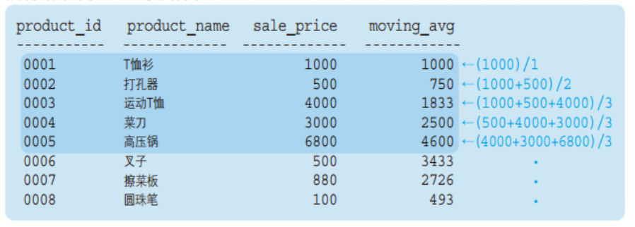

ROWS BETWEEN 1 PRECEDING AND 1 FOLLOWING：

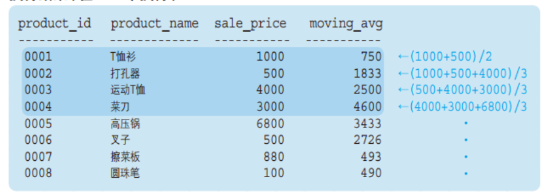

## 5.3.1 窗口函数适用范围和注意事项

* 原则上，窗口函数只能在SELECT子句中使用。
* 窗口函数OVER 中的ORDER BY 子句并不会影响最终结果的排序。其只是用来决定窗口函数按何种顺序计算。
# 5.4 GROUPING运算符

## 5.4.1 ROLLUP - 计算合计及小计

常规的GROUP BY 只能得到每个分类的小计，有时候还需要计算分类的合计，可以用 ROLLUP关键字。

```sql
SELECT  product_type
       ,regist_date
       ,SUM(sale_price) AS sum_price
  FROM product
 GROUP BY product_type, regist_date WITH ROLLUP;  
```
得到的结果为：

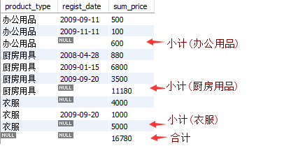

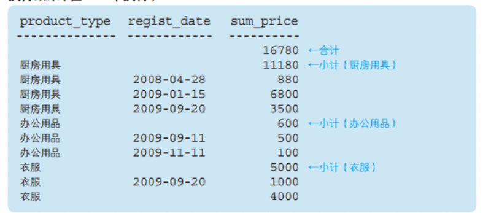

这里ROLLUP 对product_type, regist_date两列进行合计汇总。结果实际上有三层聚合，如下图 模块3是常规的 GROUP BY 的结果，需要注意的是衣服 有个注册日期为空的，这是本来数据就存在日期为空的，不是对衣服类别的合计； 模块2和1是 ROLLUP 带来的合计，模块2是对产品种类的合计，模块1是对全部数据的总计。

ROLLUP 可以对多列进行汇总求小计和合计。

# 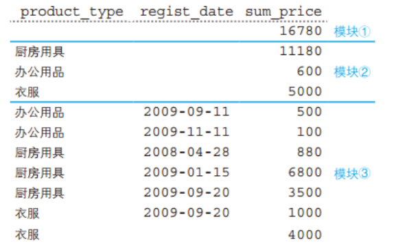

# 5.5 存储过程和函数

## 5.5.1 基本介绍

基本语法：
```sql
[delimiter //]($$，可以是其他特殊字符）
CREATE
    [DEFINER = user]
    PROCEDURE sp_name ([proc_parameter[,...]])
    [characteristic ...] 
[BEGIN]
  routine_body
[END//]($$，可以是其他特殊字符）
```
这些语句被用来创建一个存储例程（一个存储过程或函数）。也就是说，指定的例程被服务器知道了。默认情况下，一个存储例程与默认数据库相关联。要将该例程明确地与一个给定的数据库相关联，需要在创建该例程时将其名称指定为 `db_name.sp_name`。

使用 `CALL` 语句调用一个存储过程。而要调用一个存储的函数时，则要在表达式中引用它。在表达式计算期间，该函数返回一个值。

`routine_body` 由一个有效的SQL例程语句组成。它可以是一个简单的语句，如 `SELECT` 或 `INSERT`，或一个使用 `BEGIN` 和 `END` 编写的复合语句。复合语句可以包含声明、循环和其他控制结构语句。在实践中，存储函数倾向于使用复合语句，除非例程主体由一个 `RETURN` 语句组成。

## 5.5.2 参数介绍

存储过程和函数的参数有三类，分别是：`IN`，`OUT`，`INOUT`，其中：
- `IN` 是入参。每个参数默认都是一个 `IN` 参数。如需设定一个参数为其他类型参数，请在参数名称前使用关键字 `OUT` 或 `INOUT` 。一个IN参数将一个值传递给一个过程。存储过程可能会修改这个值，但是当存储过程返回时，调用者不会看到这个修改。
- `OUT` 是出参。一个 `OUT` 参数将一个值从过程中传回给调用者。它的初始值在过程中是 `NULL` ，当过程返回时，调用者可以看到它的值。
- `INOUT` ：一个 `INOUT` 参数由调用者初始化，可以被存储过程修改，当存储过程返回时，调用者可以看到存储过程的任何改变。

对于每个 `OUT` 或 `INOUT` 参数，在调用过程的 `CALL` 语句中传递一个用户定义的变量，以便在过程返回时可以获得其值。如果你是在另一个存储过程或函数中调用存储过程，你也可以将一个常规参数或本地常规变量作为 `OUT` 或 `INOUT` 参数传递。如果从一个触发器中调用存储过程，也可以将 `NEW.col_name` 作为一个 `OUT` 或 `INOUT` 参数传递。

## 5.5.2 应用示例

- 查询
下面的示例显示了一个简单的存储过程，给定一个国家代码，计算在 `world` 数据库的城市表中出现的该国家的城市数量。使用 `IN` 参数传递国家代码，使用 `OUT` 参数返回城市计数:
```sql
mysql> DELIMITER //
mysql> DROP PROCEDURE IF EXISTS citycount //
Query OK, 0 rows affected (0.01 sec)

mysql> CREATE PROCEDURE citycount (IN country CHAR(3), OUT cities INT)
       BEGIN
         SELECT COUNT(*) INTO cities FROM world.city
         WHERE CountryCode = country;
       END//
Query OK, 0 rows affected (0.01 sec)

mysql> DELIMITER ;
mysql> CALL citycount('CHN', @cities); -- cities in China
Query OK, 1 row affected (0.01 sec)

    -> SELECT @cities;
+---------+
| @cities |
+---------+
|     363 |
+---------+
1 row in set (0.04 sec)
```

- 创建表
```SQL
mysql> use world;
Database changed
mysql> DELIMITER $$
mysql> CREATE DEFINER=`root`@`localhost` PROCEDURE `product_test`()
BEGIN
    #Routine body goes here...
    CREATE TABLE product_test like shop.product;
END$$
Query OK, 0 rows affected (0.01 sec)

mysql> DELIMITER;
mysql> call `product_test`();
Query OK, 0 rows affected (0.04 sec)

mysql> show tables;
+-----------------+
| Tables_in_world |
+-----------------+
| city            |
| country         |
| countrylanguage |
| product_test    |
+-----------------+
4 rows in set (0.02 sec)
```
- 插入数据
```SQL
CREATE DEFINER=`root`@`localhost` PROCEDURE `insert_product_test`()
BEGIN
    declare i int;
    set i=1;
    while i<9 do
        set @pcid = CONCAT('000', i);
        PREPARE stmt FROM 'INSERT INTO product_test() SELECT * FROM shop.product where product_id= ?';
        EXECUTE stmt USING @pcid;
        set i=i+1;
    end while;
END
```

# 5.6 预处理声明 PREPARE Statement

MySQL 从4.1版本开始引入了 `PREPARE Statement` 特性，使用 `client/server binary protocol` 代替 `textual protocol`，其将包含占位符 （） 的查询传递给 MySQL 服务器，如以下示例所示：
```sql
SELECT * 
FROM products 
WHERE productCode = ?;
```
当MySQL使用不同的 `productCode` 值执行此查询时，它不必完全解析查询。因此，这有助于MySQL更快地执行查询，特别是当MySQL多次执行相同的查询时。productcode

由于预准备语句使用占位符 （），这有助于避免 SQL 注入的许多变体，从而使应用程序更安全。

基本语法：
```sql
PREPARE stmt_name FROM preparable_stmt
```

## 5.6.1 使用步骤

`MySQL PREPARE Statement` 使用步骤如下：

1. PREPARE – 准备需要执行的语句预处理声明。
2. EXECUTE – 执行预处理声明。
3. DEALLOCATE PREPARE – 释放预处理声明。

下图说明了预处理声明的使用过程：

# 

## 5.6.2 使用示例

这里使用 `shop` 中的 `product` 表进行演示。

首先，定义预处理声明如下：
```sql
PREPARE stmt1 FROM 
	'SELECT 
   	    product_id, 
            product_name 
	FROM product
        WHERE product_id = ?';
```
其次，声明变量 `pcid`，代表商品编号，并将其值设置为 `0005`：
```sql
SET @pcid = '0005'; 
```
第三，执行预处理声明：
```sql
EXECUTE stmt1 USING @pcid;
```
# 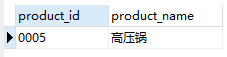

第四，为变量 `pcid` 分配另外一个商品编号：
```sql
SET @pcid = '0008'; 
```
第五，使用新的商品编号执行预处理声明：
```sql
EXECUTE stmt1 USING @pcid;
```
# 

最后，释放预处理声明以释放其占用的资源：
```sql
DEALLOCATE PREPARE stmt1;
```

# 练习题

## **5.1**

请说出针对本章中使用的 product（商品）表执行如下 SELECT 语句所能得到的结果。

```sql
SELECT  product_id
       ,product_name
       ,sale_price
       ,MAX(sale_price) OVER (ORDER BY product_id) AS Current_max_price
  FROM product;
```
## **5.2**

继续使用product表，计算出按照登记日期（regist_date）升序进行排列的各日期的销售单价（sale_price）的总额。排序是需要将登记日期为NULL 的“运动 T 恤”记录排在第 1 位（也就是将其看作比其他日期都早）

## **5.3**

思考题

① 窗口函数不指定PARTITION BY的效果是什么？

② 为什么说窗口函数只能在SELECT子句中使用？实际上，在ORDER BY 子句使用系统并不会报错。

## **5.4**

使用简洁的方法创建20个与 `shop.product` 表结构相同的表，如下图所示：

# 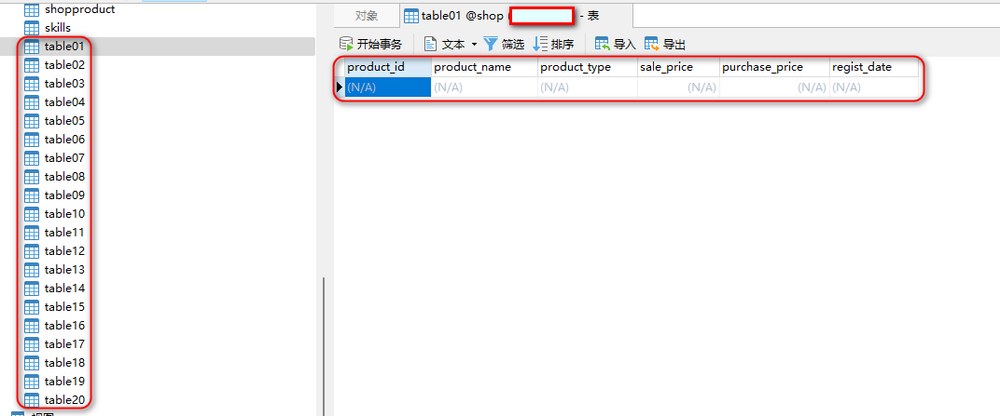


