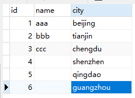

# 第六章：决胜秋招

## Section A

### 练习一: 各部门工资最高的员工（难度：中等）

创建Employee 表，包含所有员工信息，每个员工有其对应的 Id, salary 和 department Id。

```plain
+----+-------+--------+--------------+
| Id | Name  | Salary | DepartmentId |
+----+-------+--------+--------------+
| 1  | Joe   | 70000  | 1            |
| 2  | Henry | 80000  | 2            |
| 3  | Sam   | 60000  | 2            |
| 4  | Max   | 90000  | 1            |
+----+-------+--------+--------------+
```
创建Department 表，包含公司所有部门的信息。
```plain
+----+----------+
| Id | Name     |
+----+----------+
| 1  | IT       |
| 2  | Sales    |
+----+----------+
```
编写一个 SQL 查询，找出每个部门工资最高的员工。例如，根据上述给定的表格，Max 在 IT 部门有最高工资，Henry 在 Sales 部门有最高工资。
```plain
+------------+----------+--------+
| Department | Employee | Salary |
+------------+----------+--------+
| IT         | Max      | 90000  |
| Sales      | Henry    | 80000  |
+------------+----------+--------+
```

### 练习二: 换座位（难度：中等）

小美是一所中学的信息科技老师，她有一张 seat 座位表，平时用来储存学生名字和与他们相对应的座位 id。

其中纵列的**id**是连续递增的

小美想改变相邻俩学生的座位。

你能不能帮她写一个 SQL query 来输出小美想要的结果呢？

请创建如下所示seat表：

**示例：**

```plain
+---------+---------+
|    id   | student |
+---------+---------+
|    1    | Abbot   |
|    2    | Doris   |
|    3    | Emerson |
|    4    | Green   |
|    5    | Jeames  |
+---------+---------+
```
假如数据输入的是上表，则输出结果如下：
```plain
+---------+---------+
|    id   | student |
+---------+---------+
|    1    | Doris   |
|    2    | Abbot   |
|    3    | Green   |
|    4    | Emerson |
|    5    | Jeames  |
+---------+---------+
```
**注意：**
如果学生人数是奇数，则不需要改变最后一个同学的座位。


### 练习三:  分数排名（难度：中等）

假设在某次期末考试中，二年级四个班的平均成绩分别是 `93、93、93、91`，请问可以实现几种排名结果？分别使用了什么函数？排序结果是怎样的？（只考虑降序）

```plain
+-------+-----------+
| class | score_avg |
+-------+-----------+
|    1  |       93  |
|    2  |       93  |
|    3  |       93  |
|    4  |       91  |
+-------+-----------+
```

### 练习四：连续出现的数字（难度：中等）

编写一个 SQL 查询，查找所有至少连续出现三次的数字。

```plain
+----+-----+
| Id | Num |
+----+-----+
| 1  |  1  |
| 2  |  1  |
| 3  |  1  |
| 4  |  2  |
| 5  |  1  |
| 6  |  2  |
| 7  |  2  |
+----+-----+
```
例如，给定上面的 Logs 表， 1 是唯一连续出现至少三次的数字。
```plain
+-----------------+
| ConsecutiveNums |
+-----------------+
| 1               |
+-----------------+
```
### 练习五：树节点 （难度：中等）

对于**tree**表，*id*是树节点的标识，*p_id*是其父节点的*id*。

```plain
+----+------+
| id | p_id |
+----+------+
| 1  | null |
| 2  | 1    |
| 3  | 1    |
| 4  | 2    |
| 5  | 2    |
+----+------+
```
每个节点都是以下三种类型中的一种：
* Root: 如果节点是根节点。
* Leaf: 如果节点是叶子节点。
* Inner: 如果节点既不是根节点也不是叶子节点。

写一条查询语句打印节点id及对应的节点类型。按照节点id排序。上面例子的对应结果为：

```plain
+----+------+
| id | Type |
+----+------+
| 1  | Root |
| 2  | Inner|
| 3  | Leaf |
| 4  | Leaf |
| 5  | Leaf |
+----+------+
```
**说明**
* 节点’1’是根节点，因为它的父节点为NULL，有’2’和’3’两个子节点。
* 节点’2’是内部节点，因为它的父节点是’1’，有子节点’4’和’5’。
* 节点’3’，‘4’，'5’是叶子节点，因为它们有父节点但没有子节点。

下面是树的图形：

        1         
      /   \ 
     2    3    
    / \
    4  5

**注意**

如果一个树只有一个节点，只需要输出根节点属性。

### 练习六：至少有五名直接下属的经理 （难度：中等）

**Employee**表包含所有员工及其上级的信息。每位员工都有一个Id，并且还有一个对应主管的Id（ManagerId）。

```plain
+------+----------+-----------+----------+
|Id    |Name 	  |Department |ManagerId |
+------+----------+-----------+----------+
|101   |John 	  |A 	      |null      |
|102   |Dan 	  |A 	      |101       |
|103   |James 	  |A 	      |101       |
|104   |Amy 	  |A 	      |101       |
|105   |Anne 	  |A 	      |101       |
|106   |Ron 	  |B 	      |101       |
+------+----------+-----------+----------+
```
针对**Employee**表，写一条SQL语句找出有5个下属的主管。对于上面的表，结果应输出：

```plain
+-------+
| Name  |
+-------+
| John  |
+-------+
```
**注意:**

没有人向自己汇报。

### 练习七：查询回答率最高的问题 （难度：中等）

求出**survey_log**表中回答率最高的问题，表格的字段有：**uid, action, question_id, answer_id, q_num, timestamp**。

uid是用户id；action的值为：“show”， “answer”， “skip”；当action是"answer"时，answer_id不为空，相反，当action是"show"和"skip"时为空（null）；q_num是问题的数字序号。

写一条sql语句找出回答率最高的 `question_id`。

**举例：**

**输入**

| uid  | action | question_id  | answer_id  | q_num|timestamp  |
|:----|:----|:----|:----|:----|:----|
|5| show      |285| null       |1|123|
|5| answer    |285|124124|1|124|
|5| show      |369| null       |2|125|
|5| skip      |369| null       |2|126|

**输出**

|question_id  |
|:----|
|285      |

**说明**

问题285的回答率为1/1，然而问题369的回答率是0/1，所以输出是285。

**注意：** 

最高回答率的意思是：同一个问题出现的次数中回答的比例。

### 练习八：各部门前3高工资的员工（难度：中等）

将练习一中的 `employee` 表清空，重新插入以下数据（也可以复制练习一中的 `employee` 表，再插入第5、第6行数据）：

```plain
+----+-------+--------+--------------+
| Id | Name  | Salary | DepartmentId |
+----+-------+--------+--------------+
| 1  | Joe   | 70000  | 1            |
| 2  | Henry | 80000  | 2            |
| 3  | Sam   | 60000  | 2            |
| 4  | Max   | 90000  | 1            |
| 5  | Janet | 69000  | 1            |
| 6  | Randy | 85000  | 1            |
+----+-------+--------+--------------+
```
编写一个 SQL 查询，找出每个部门工资前三高的员工。例如，根据上述给定的表格，查询结果应返回：
```plain
+------------+----------+--------+
| Department | Employee | Salary |
+------------+----------+--------+
| IT         | Max      | 90000  |
| IT         | Randy    | 85000  |
| IT         | Joe      | 70000  |
| Sales      | Henry    | 80000  |
| Sales      | Sam      | 60000  |
+------------+----------+--------+
```
此外，请考虑实现各部门前N高工资的员工功能。

### 练习九：平面上最近距离 (难度: 困难）

**point_2d**表包含一个平面内一些点（超过两个）的坐标值（x，y）。

写一条查询语句求出这些点中的最短距离并保留2位小数。

```plain
|x   | y  |
|----|----|
| -1 | -1 |
|  0 |  0 |
| -1 | -2 |
```
最短距离是1，从点（-1，-1）到点（-1，-2）。所以输出结果为：

| shortest |

1.00

```plain
+--------+
|shortest|
+--------+
|1.00    |
+--------+
```
**注意：**所有点的最大距离小于10000。

### 练习十：行程和用户（难度：困难）

Trips 表中存所有出租车的行程信息。每段行程有唯一键 Id，Client_Id 和 Driver_Id 是 Users 表中 Users_Id 的外键。Status 是枚举类型，枚举成员为 (‘completed’, ‘cancelled_by_driver’, ‘cancelled_by_client’)。

| Id | Client_Id | Driver_Id | City_Id |          Status      |Request_at|
|:----|:----|:----|:----|:----|:----|
|1|1|10|1|     completed      |2013-10-1|
|2|2|11|1| cancelled_by_driver|2013-10-1|
|3|3|12|6|     completed      |2013-10-1|
|4|4|13|6| cancelled_by_client|2013-10-1|
|5|1|10|1|     completed      |2013-10-2|
|6|2|11|6|     completed      |2013-10-2|
|7|3|12|6|     completed      |2013-10-2|
|8|2|12|12|     completed      |2013-10-3|
|9|3|10|12|     completed      |2013-10-3|
|10|4|13|12| cancelled_by_driver|2013-10-3|

Users 表存所有用户。每个用户有唯一键 Users_Id。Banned 表示这个用户是否被禁止，Role 则是一个表示（‘client’, ‘driver’, ‘partner’）的枚举类型。

```plain
+----------+--------+--------+
| Users_Id | Banned |  Role  |
+----------+--------+--------+
|    1     |   No   | client |
|    2     |   Yes  | client |
|    3     |   No   | client |
|    4     |   No   | client |
|    10    |   No   | driver |
|    11    |   No   | driver |
|    12    |   No   | driver |
|    13    |   No   | driver |
+----------+--------+--------+
```
写一段 SQL 语句查出**2013年10月1日**至**2013年10月3日**期间非禁止用户的取消率。基于上表，你的 SQL 语句应返回如下结果，取消率（Cancellation Rate）保留两位小数。
```plain
+------------+-------------------+
|     Day    | Cancellation Rate |
+------------+-------------------+
| 2013-10-01 |       0.33        |
| 2013-10-02 |       0.00        |
| 2013-10-03 |       0.50        |
+------------+-------------------+
```

## Section B

### 练习一：行转列
假设 A B C 三位小朋友期末考试成绩如下所示：
```plain
+-----+-----------+------|
| name|   subject |score |
+-----+-----------+------|
|  A  |  chinese  |  99  |
|  A  |  math     |  98  |
|  A  |  english  |  97  |
|  B  |  chinese  |  92  |
|  B  |  math     |  91  |
|  B  |  english  |  90  |
|  C  |  chinese  |  88  |
|  C  |  math     |  87  |
|  C  |  english  |  86  |
+-----+-----------+------|
```
请使用 SQL 代码将以上成绩转换为如下格式：
```plain
+-----+-----------+------|---------|
| name|   chinese | math | english |
+-----+-----------+------|---------|
|  A  |     99    |  98  |    97   |
|  B  |     92    |  91  |    90   |
|  C  |     88    |  87  |    86   |
+-----+-----------+------|---------|
```

### 练习二：列转行
假设 A B C 三位小朋友期末考试成绩如下所示：
```plain
+-----+-----------+------|---------|
| name|   chinese | math | english |
+-----+-----------+------|---------|
|  A  |     99    |  98  |    97   |
|  B  |     92    |  91  |    90   |
|  C  |     88    |  87  |    86   |
+-----+-----------+------|---------|
```
请使用 SQL 代码将以上成绩转换为如下格式：
```plain
+-----+-----------+------|
| name|   subject |score |
+-----+-----------+------|
|  A  |  chinese  |  99  |
|  A  |  math     |  98  |
|  A  |  english  |  97  |
|  B  |  chinese  |  92  |
|  B  |  math     |  91  |
|  B  |  english  |  90  |
|  C  |  chinese  |  88  |
|  C  |  math     |  87  |
|  C  |  english  |  86  |
+-----+-----------+------|
```
### 练习三：谁是明星带货主播？
假设，某平台2021年主播带货销售额日统计数据如下：

表名 `anchor_sales`
```plain
+-------------+------------+---------|
| anchor_name |     date   |  sales  | 
+-------------+------------+---------|
|      A      |  20210101  |  40000  |
|      B      |  20210101  |  80000  |
|      A      |  20210102  |  10000  |
|      C      |  20210102  |  90000  |
|      A      |  20210103  |   7500  |
|      C      |  20210103  |  80000  |
+-------------+------------+---------|
```
定义：如果某主播的某日销售额占比达到该平台当日销售总额的 90% 及以上，则称该主播为明星主播，当天也称为明星主播日。

请使用 SQL 完成如下计算：

a. 2021年有多少个明星主播日？

b. 2021年有多少个明星主播？

### 练习四：MySQL 中如何查看sql语句的执行计划？可以看到哪些信息？

### 练习五：解释一下 SQL 数据库中 ACID 是指什么

## Section C

### 练习一：行转列

假设有如下比赛结果：

```plain
+--------------+-----------+
|    cdate     |   result  |
+--------------+-----------+
|  2021-01-01  |     胜    |
|  2021-01-01  |     胜    |
|  2021-01-01  |     负    |
|  2021-01-03  |     胜    |
|  2021-01-03  |     负    |
|  2021-01-03  |     负    |
+------------+-------------+
```

请使用 SQL 将比赛结果转换为如下形式：

```plain
+--------------+-----+-----|
|  比赛日期     | 胜  | 负  |
+--------------+-----------+
|  2021-01-01  |  2  |  1  |
|  2021-01-03  |  1  |  2  |
+------------+-----------+
```
### 练习二：列转行

假设有如下比赛结果：

```plain
+--------------+-----+-----|
|  比赛日期     | 胜  | 负  |
+--------------+-----------+
|  2021-01-01  |  2  |  1  |
|  2021-01-03  |  1  |  2  |
+------------+-----------+
```

请使用 SQL 将比赛结果转换为如下形式：

```plain
+--------------+-----------+
|    cdate     |   result  |
+--------------+-----------+
|  2021-01-01  |     胜    |
|  2021-01-01  |     胜    |
|  2021-01-01  |     负    |
|  2021-01-03  |     胜    |
|  2021-01-03  |     负    |
|  2021-01-03  |     负    |
+------------+-------------+
```

### 练习三：连续登录

有用户表行为记录表t_act_records表，包含两个字段：uid（用户ID），imp_date（日期）

1. 计算2021年每个月，每个用户连续登录的最多天数
2. 计算2021年每个月，连续2天都有登录的用户名单
3. 计算2021年每个月，连续5天都有登录的用户数

构造表mysql如下：
```sql
DROP TABLE if EXISTS t_act_records;
CREATE TABLE t_act_records
(uid  VARCHAR(20),
imp_date DATE);

INSERT INTO t_act_records VALUES('u1001', 20210101);
INSERT INTO t_act_records VALUES('u1002', 20210101);
INSERT INTO t_act_records VALUES('u1003', 20210101);
INSERT INTO t_act_records VALUES('u1003', 20210102);
INSERT INTO t_act_records VALUES('u1004', 20210101);
INSERT INTO t_act_records VALUES('u1004', 20210102);
INSERT INTO t_act_records VALUES('u1004', 20210103);
INSERT INTO t_act_records VALUES('u1004', 20210104);
INSERT INTO t_act_records VALUES('u1004', 20210105);
```

## 练习四：用户购买商品推荐

假设现在需要根据算法给每个 `user_id` 推荐购买商品，推荐算法比较简单，推荐和他相似的用户购买过的 `product` 即可，说明如下：
- 排除用户自己购买过的商品
- 相似用户定义：曾经购买过 2 种或 2 种以上的相同的商品

输入表：`orders`
```plain
+---------+------------+
| user_id | product_id |
+---------+------------+
|     123 |          1 |
|     123 |          2 |
|     123 |          3 |
|     456 |          1 |
|     456 |          2 |
|     456 |          4 |
+---------+------------+
```

输出表：
```plain
+---------+------------+
| user_id | product_id |
+---------+------------+
|     123 |          4 |
|     456 |          3 |
+---------+------------+
```

### 练习五：hive 数据倾斜的产生原因及优化策略？


### 练习六：LEFT JOIN 是否可能会出现多出的行？为什么？

假设 t1 表有6行（关联列 name 有2行为空），t2 表有6行（关联列 name 有3行为空）,

那么 `SELECT * FROM t1 LEFT JOIN t2 on t1.name = t2.name` 会返回多少行结果？

可以参考下图

t1 表：     t2 表：

### 写一写本次学习的收获。

感谢本课程有帮助的话，可以帮忙 `star` ~~

